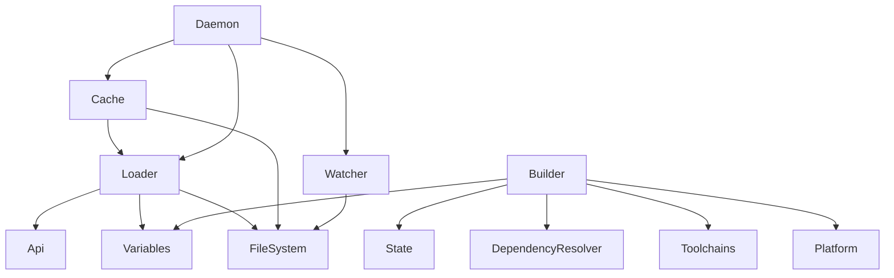

# Jenga – Core

Le module **Core** est le **moteur de build** de Jenga. Il contient tous les composants essentiels à l'exécution des commandes : chargement du workspace, gestion du cache, résolution des dépendances, compilation incrémentale, surveillance de fichiers, et communication avec le daemon.

---

## 📚 Sommaire

- [Architecture générale](#-architecture-générale)
- [Composants principaux](#-composants-principaux)
  - [1. `Api.py` – DSL et contexte](#1-apipy--dsl-et-contexte)
  - [2. `Variables.py` – Expansion des variables](#2-variablespy--expansion-des-variables)
  - [3. `Loader.py` – Chargement du workspace](#3-loaderpy--chargement-du-workspace)
  - [4. `Cache.py` – Cache persistant SQLite](#4-cachepy--cache-persistant-sqlite)
  - [5. `State.py` – État du build en cours](#5-statepy--état-du-build-en-cours)
  - [6. `DependencyResolver.py` – Ordre de compilation](#6-dependencyresolverpy--ordre-de-compilation)
  - [7. `Platform.py` – Détection hôte et cible](#7-platformpy--détection-hôte-et-cible)
  - [8. `Toolchains.py` – Détection et gestion des compilateurs](#8-toolchainspy--détection-et-gestion-des-compilateurs)
  - [9. `Builder.py` – Classe de base des builders](#9-builderpy--classe-de-base-des-builders)
  - [10. `Incremental.py` – Hash et décision de recompilation](#10-incrementalpy--hash-et-décision-de-recompilation)
  - [11. `Watcher.py` – Surveillance de fichiers](#11-watcherpy--surveillance-de-fichiers)
  - [12. `Daemon.py` – Processus arrière‑plan](#12-daemonpy--processus-arrièreplan)
  - [13. `Utils.py` – Utilitaires internes (optionnel)](#13-utilspy--utilitaires-internes-optionnel)
- [Flux de données typique](#-flux-de-données-typique)
- [Conventions de nommage](#-conventions-de-nommage)
- [Dépendances internes](#-dépendances-internes)
- [Extensions : Builders](#-extensions--builders)
- [Bonnes pratiques pour le développement](#-bonnes-pratiques-pour-le-développement)

---

## 🧠 Architecture générale

```
┌─────────────────────────────────────────────────────────────────┐
│                         Commande CLI                           │
│  (Build, Run, Test, Watch, …)                                 │
└───────────────────────────────┬─────────────────────────────────┘
                                │
                                ▼
┌─────────────────────────────────────────────────────────────────┐
│                         Daemon (optionnel)                      │
│                  ┌─────────────────────────────┐                │
│                  │   Cache SQLite (.jenga/)    │                │
│                  └─────────────┬───────────────┘                │
│                                │                                │
│                                ▼                                │
│  ┌─────────────┐  ┌─────────────┐  ┌─────────────────────────┐  │
│  │   Loader    │  │  Workspace  │  │   VariableExpander      │  │
│  └─────────────┘  └─────────────┘  └─────────────────────────┘  │
│         │               │                       │               │
│         ▼               ▼                       ▼               │
│  ┌─────────────┐  ┌─────────────┐  ┌─────────────────────────┐  │
│  │ Cache       │  │ BuildState  │  │ DependencyResolver      │  │
│  └─────────────┘  └─────────────┘  └─────────────────────────┘  │
│         │               │                       │               │
│         └───────────────┴───────────────────────┘               │
│                                │                                │
│                                ▼                                │
│  ┌───────────────────────────────────────────────────────────┐  │
│  │                        Builder                            │  │
│  │  (classe abstraite, délègue aux builders concrets)       │  │
│  └───────────────────────────────────────────────────────────┘  │
│                                │                                │
│                                ▼                                │
│  ┌───────────────────────────────────────────────────────────┐  │
│  │                 Platform-specific Builders                │  │
│  │  (Windows, Linux, macOS, Android, iOS, Xbox, …)          │  │
│  └───────────────────────────────────────────────────────────┘  │
└─────────────────────────────────────────────────────────────────┘
```

---

## 🧩 Composants principaux

### 1. `Api.py` – DSL et contexte
- Fournit les **context managers** (`workspace`, `project`, `toolchain`, `unitest`, `test`, `include`, …).
- Définit les **énumérations** (`TargetOS`, `CompilerFamily`, …) et les **dataclasses** (`Workspace`, `Project`, `Toolchain`).
- Expose les **fonctions utilisateur** en **lowercase, one word** (`files`, `defines`, `links`, `debug`, `release`, …).
- Maintient l'état global (`_currentWorkspace`, `_currentProject`, …) utilisé par le `Loader`.

### 2. `Variables.py` – Expansion des variables
- Moteur d'expansion des chaînes contenant `%{...}`.
- Namespaces supportés :
  - `wks`, `workspace` – propriétés du workspace.
  - `prj`, `project` – propriétés du projet courant.
  - `cfg` – configuration de build (`name`, `buildcfg`, `platform`).
  - `unitest` – configuration Unitest.
  - `test` – projet de test courant.
  - `toolchain` – toolchain courante.
  - `<nom_projet>` – n'importe quel projet du workspace.
  - `env` – variables d'environnement.
  - `Jenga` – variables internes (`Root`, `Version`, …).
- Méthode `ExpandAll()` pour appliquer récursivement l'expansion sur un objet.
- Résolution des chemins (absolu / relatif au workspace).

### 3. `Loader.py` – Chargement du workspace
- Exécute un fichier `.jenga` via `exec()` après avoir préparé le contexte (`_PrepareGlobals`).
- Construit l'objet `Workspace` et appelle `_PostProcessWorkspace` pour :
  - Définir les valeurs par défaut de `objDir`, `targetDir`.
  - Appliquer l'expansion des variables via `VariableExpander`.
  - Normaliser les chemins.
- Gère le chargement des fichiers externes (via `include`) avec un workspace temporaire.
- Peut charger un projet **standalone** (hors workspace).

### 4. `Cache.py` – Cache persistant SQLite
- Stocke le **workspace sérialisé** (JSON avec reconstruction des objets via un hook).
- Enregistre les métadonnées de tous les fichiers `.jenga` (mtime, hash).
- Détecte les **changements** (ajout, suppression, modification) et permet une **mise à jour incrémentale** (rechargement des seuls fichiers modifiés).
- Nom de la base dérivé du **nom du workspace** (ou du dossier racine).
- Thread‑safe, utilise `PRAGMA journal_mode = WAL`.

### 5. `State.py` – État du build en cours
- Enregistre pour chaque build :
  - Les projets déjà compilés (ou en échec).
  - Les hash des fichiers sources (pour décision de recompilation).
  - Les dépendances (headers) découvertes.
  - Les fichiers objets et binaires produits.
- Fournit des méthodes de sérialisation pour reprise de build.

### 6. `DependencyResolver.py` – Ordre de compilation
- Construit le **graphe des dépendances** à partir de `dependsOn`.
- Tri topologique (algorithme de Kahn).
- Détection des cycles.
- Possibilité de restreindre à un projet cible (build partiel).

### 7. `Platform.py` – Détection hôte et cible
- Détermine l'OS, l'architecture et l'environnement de la machine hôte.
- Fournit des méthodes de normalisation de cible (`TargetOS`, `TargetArch`, `TargetEnv`).
- Vérifie si une combinaison (OS, arch) est supportée.
- Parse les triples (ex: `x86_64-pc-linux-gnu`).

### 8. `Toolchains.py` – Détection et gestion des compilateurs
- Détecte automatiquement les compilateurs installés :
  - **Host** : GCC, Clang, MSVC (Windows).
  - **Cross** : Android NDK, Emscripten, MinGW (Windows → Linux).
  - **Windows** : détection MSVC via `vswhere`, Clang, MinGW.
- Résout la meilleure toolchain pour une cible donnée (`ResolveForTarget`).
- Permet d'ajouter manuellement des toolchains.

### 9. `Builder.py` – Classe de base des builders
- Classe **abstraite** définissant le contrat pour tous les builders de plateforme.
- Fournit des méthodes communes :
  - `GetObjectDir()`, `GetTargetDir()` – chemins par défaut.
  - `IsModuleFile()` – détection des modules C++20 (`.cppm`, `.ixx`, …).
  - `GetModuleFlags()` – abstraite, à implémenter.
  - `BuildProject()` – orchestration compilation + link.
- Utilise `DependencyResolver` et `ToolchainManager`.

### 10. `Incremental.py` – Hash et décision de recompilation
- Calcule les hash (SHA‑256) des fichiers sources et des flags.
- Compare avec l'état précédent (`BuildState`) pour décider si un projet ou un fichier doit être recompilé.
- Parse les fichiers `.d` (dépendances Make) pour suivre les headers inclus.

### 11. `Watcher.py` – Surveillance de fichiers
- Surveille les fichiers `.jenga` et les sources du workspace.
- Deux modes :
  - **Watchdog** (recommandé) – utilise la bibliothèque `watchdog` pour des notifications instantanées.
  - **Polling** – fallback pour systèmes sans `watchdog`.
- Déclenche des callbacks sur les événements `created`, `modified`, `deleted`.

### 12. `Daemon.py` – Processus arrière‑plan
- Maintient le workspace en mémoire pour des commandes **instantanées**.
- Communication via **socket TCP local** (port aléatoire).
- Support complet de **daemonization** sur Unix (double fork) et Windows (`DETACHED_PROCESS`).
- Exécute les commandes RPC (`build`, `run`, `test`, `clean`, `watch`).
- Met à jour le cache incrémentalement.

### 13. `Utils.py` – Utilitaires internes (optionnel)
- Dans certaines versions, peut contenir des fonctions partagées entre les modules `Core`.
- **N'est pas le même que `Jenga/Utils/`** – ce dernier est un package indépendant.

---

## 🔁 Flux de données typique

1. **Commande CLI** (ex: `jenga build`) :
   - Appelle `BuildCommand.Execute()`.
   - Tente de se connecter au daemon (si disponible et `--no-daemon` non spécifié).
2. **Chargement du workspace** :
   - `FileSystem.FindWorkspaceEntry()` détecte le fichier `.jenga` racine.
   - `Cache.LoadWorkspace()` : si cache valide, désérialise le workspace ; sinon `Loader.LoadWorkspace()`.
3. **Post‑traitement** :
   - `VariableExpander.ExpandAll()` sur tout le workspace.
   - Normalisation des chemins.
4. **Création du builder** :
   - `BuildCommand.CreateBuilder()` instancie le builder correspondant à la plateforme.
5. **Exécution du build** :
   - `Builder.Build()` → `DependencyResolver.ResolveBuildOrder()` → pour chaque projet : `BuildProject()`.
   - `BuildProject()` appelle `Compile()` et `Link()`.
6. **Mise à jour de l'état** :
   - `BuildState` enregistre les hash, dépendances, sorties.
   - Si le daemon tourne, le workspace est maintenu en mémoire.

---

## 📐 Conventions de nommage

Le module `Core` respecte **strictement** les conventions énoncées dans `Api.py` :

| Élément                          | Convention      | Exemple                          |
|----------------------------------|-----------------|----------------------------------|
| Classes                          | PascalCase      | `Loader`, `VariableExpander`     |
| Méthodes publiques              | PascalCase      | `LoadWorkspace()`, `Expand()`    |
| Méthodes privées                | _PascalCase     | `_PrepareGlobals()`             |
| Attributs privés/protégés       | _camelCase      | `_currentWorkspace`             |
| Variables internes (non publiques) | camelCase    | `workspaceName`                 |
| Constantes                      | UPPER_SNAKE_CASE| `_CACHE_VERSION`                |

Ces conventions s'appliquent **à tous les fichiers** du dossier `Core`.

---

## 🔗 Dépendances internes



Tous les composants peuvent importer des utilitaires depuis `Jenga/Utils/` (ex: `FileSystem`, `Process`, `Colored`).

---

## 🧱 Extensions : Builders

Le dossier `Core/Builders/` contient les **implémentations concrètes** des builders pour chaque plateforme.  
Ces classes héritent de `Builder` et doivent :

- Implémenter `Compile()`, `Link()`, `GetObjectExtension()`, `GetOutputExtension()`, `GetModuleFlags()`.
- Utiliser `self.toolchain` pour obtenir les chemins des exécutables.
- Gérer les spécificités de la plateforme (signature, packaging, …).

**Voir le README dédié :** [Builders/README.md](./Builders/README.md)

---

## ✅ Bonnes pratiques pour le développement

1. **Toujours utiliser `VariableExpander.ExpandAll()` après avoir chargé ou modifié un workspace.**
2. **Ne jamais écrire de chemins absolus en dur** – utiliser les variables `%{...}` ou les méthodes `GetObjectDir`, `GetTargetDir`.
3. **Pour ajouter une nouvelle plateforme :**
   - Créer un nouveau fichier dans `Builders/`.
   - Implémenter toutes les méthodes abstraites.
   - Ajouter l'export dans `Builders/__init__.py`.
4. **Gérer les modules C++20** : vérifier `IsModuleFile()` et fournir `GetModuleFlags()`.
5. **Validation hôte/cible** : dans le constructeur du builder, appeler `_ValidateHostTarget()` (déjà dans `Builder.__init__`).
6. **Logs** : utiliser `Colored.PrintInfo`, `Colored.PrintWarning`, `Colored.PrintError` avec modération.
7. **Tests** : (à venir) les composants critiques (`Loader`, `Cache`, `DependencyResolver`) doivent être testés unitairement.

---

## 📖 Ressources complémentaires

- [Documentation Utilisateur](../../README.md) (racine du projet)
- [Guide des commandes](../Commands/README.md)
- [Système de tests Unitest](../Unitest/README.md)
- [Utilitaires Jenga](../Utils/README.md)

---

*Ce document est maintenu par l'équipe Jenga. Toute contribution est la bienvenue.*
```